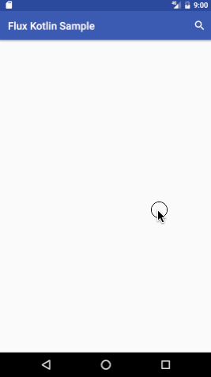

Flux with Kotlin on Android Example
======



Getting Started
----

This application uses GitHub API(just for search users). You can create GitHub access token and write to `gradle.properties` as belows.

```
GITHUB_TOKEN="your access token"
```

Flux
----
http://facebook.github.io/flux/docs/overview.html#content

Libraries
---------

see [sample/build.gradle](./sample/build.gradle)

Inspired by
------
* kotlin-android-flux - https://github.com/satorufujiwara/kotlin-android-flux
* Flux with RxSwift - http://www.slideshare.net/yuujihato/flux-with-rxswift

License
-------
    Copyright 2016 Hikaru Wada

    Licensed under the Apache License, Version 2.0 (the "License");
    you may not use this file except in compliance with the License.
    You may obtain a copy of the License at

       http://www.apache.org/licenses/LICENSE-2.0

    Unless required by applicable law or agreed to in writing, software
    distributed under the License is distributed on an "AS IS" BASIS,
    WITHOUT WARRANTIES OR CONDITIONS OF ANY KIND, either express or implied.
    See the License for the specific language governing permissions and
    limitations under the License.
